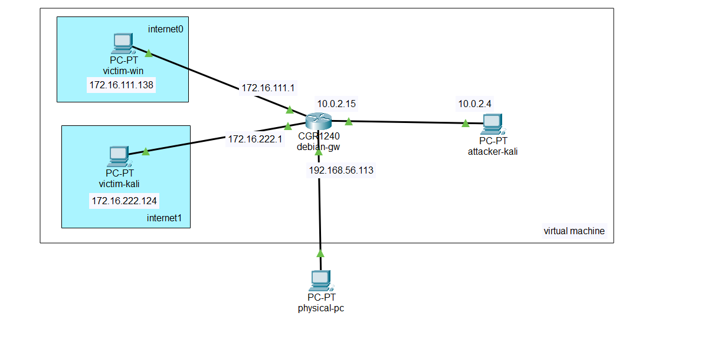
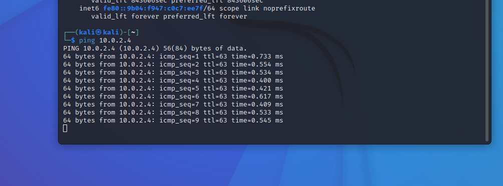

# ns_chap0x01 基于 VirtualBox 的网络攻防基础环境搭建

## 实验目的

- 掌握 VirtualBox 虚拟机的安装与使用；
- 掌握 VirtualBox 的虚拟网络类型和按需配置；
- 掌握 VirtualBox 的虚拟硬盘多重加载

## 实验环境

以下是本次实验需要使用的网络节点说明和主要软件举例：

- VirtualBox 虚拟机
- 攻击者主机（Attacker）：Kali Rolling 2019.2
- 网关（Gateway, GW）：Debian Buster
- 靶机（Victim）：From Sqli to shell / xp-sp3 / Kali

## 实验要求

- [x] 虚拟硬盘多重加载

- [x] 搭建满足如下图所示的虚拟机网络拓扑

- [x] 完成以下网络连通性测试；
  
  - [x] 靶机可以直接访问攻击者主机
  - [x] 攻击者主机无法直接访问靶机
  - [x] 网关可以直接访问攻击者主机和靶机
  - [x] 靶机的所有对外上下行流量必须经过网关
  - [x] 所有节点均可以访问互联网

## 实验过程记录

### 写在前面

**完成配置后的总结**

- 拓扑图

- 对应表格

| pc          | role     | network   | ip             |
|:-----------:|:--------:|:---------:|:--------------:|
| physical-pc | host     | --        | --             |
| windows-XP  | victim   | internal0 | 172.16.111.138 |
| kali        | victim   | internal1 | 172.16.222.124 |
| kali        | attacker | NAT网络     | 10.0.2.4       |
| debian      | gateway  | internal0 | 172.16.111.1   |
| debian      | gateway  | internal1 | 172.16.222.1   |
| debian      | gateway  | host-only | 192.168.56.113 |
| debian      | gateway  | NAT网络     | 10.0.2.15      |

 

### 多重加载

按照课程提供链接，完成虚拟盘下载并导入，设置为多重加载 

### debian基础配置

完成网关虚拟机的网卡配置

且保证"物理层“网络已连接

运行deiban系统，准备使用ssh连接宿主机和虚拟机


发现连通性没有问题，但是被拒绝了，想了很久可能是因为用的『 root 』用户，因为想连通了再建立用户来着，然后看了一眼设置

果然 `PermitRootlogin`是被注释掉的

创建『 NS 』用户组，创建『 ns_winnie 』用户并加入该用户组，为了后续操作方便，也将其加入了『sudo』group

```bash
groupadd NS
useradd ns_winnie
usermod -aG NS ns_winnie 
```

ssh连接成功

### 有关attacker 和 victim 的靶场环境配置

**victim-win**

将windows-xp配置好网卡为『内部网络』后，检查windows，其实直接就有检测到网卡诶但其实可以看到配置，是1000T的

> 这里猜测是官网更新了vdi叭，可能已经包含了『千兆网卡』的驱动吧

手动配置ip地址后，由windows-xp靶机向网关『单方向』成功连接


关闭防火墙后，网关到靶机联机成功，至此**双向连接成功**

测试靶机可单向访问攻击者

靶机可连接网络

**victim-kali**

kali完成『多重加载』、网卡配置

dhcp分配ip`172.16.222.124`

测试靶机可单向访问攻击者

测试靶机可以访问internet


**attacker-kali**

完成攻击者网络配置，且使用多重加载（与靶机kali源于统一虚拟硬盘）

测试攻击者无法直接访问靶机

### 网关配置

基于[debian基础配置](#debian基础配置)，完成靶场环境连通性测试

可访问靶机、攻击者


访问互联网


对于上下行流量必须经过网关的测试，成功


