# HTTP代理服务器实验

## 实验环境 
- kali
  - Description:    Kali GNU/Linux Rolling
  - Release:        2022.3
  - Codename:       kali-rolling
- wireshark
  - Wireshark 3.6.6 (Git v3.6.6 packaged as 3.6.6-1)
- tinyproxy
  - version 1.11.1


## 实验要求
- [x] 在 Kali Linux 中安装 tinyproxy，然后用主机设置浏览器代理指向 tinyproxy 建立的 HTTP 正向代理
- [x] 在 Kali 中用 wireshark 抓包，分析抓包过程，理解 HTTP 正向代理 HTTPS 流量的特点
  
## 实验记录

Q：使用 http 代理服务器访问 HTTPS 站点时，通信传输内容是否会被代理服务器“看到”？

A：结论是代理服务器不知道客户端和服务器的 HTTPS 通信内容，但代理服务器知道客户端访问了哪个 HTTPS 站点，这是由 http 代理的协议机制决定的：代理客户端会发送 Connect 请求到 http 代理服务器。

实验验证：在 Kali Linux 中安装 tinyproxy，然后用主机设置浏览器代理指向 tinyproxy 建立的 HTTP 正向代理，在 Kali 中用 wireshark 抓包，分析抓包过程，理解 HTTP 正向代理 HTTPS 流量的特点。
> 提醒注意：
> HTTP 代理服务器在转发客户端请求时，可能会添加 Via 字段，从而向目标站点暴露客户端正在使用代理访问。类似的，匿名通信应用 tor 的部分出口节点也会在http请求中自动加入 via 字段，向被访问站点宣告：当前请求正在使用匿名通信网络 tor 提供的匿名通信服务。

### 配置环境
首先在kali上安装 tinyproxy 
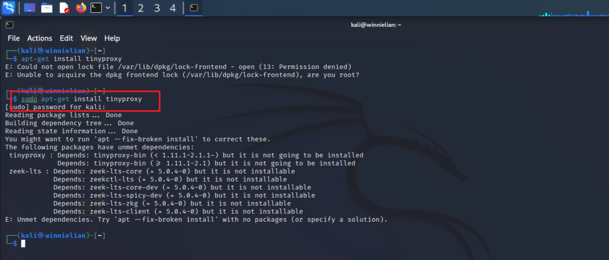
```sh
sudo apt install tinyproxy
# 这里是之前有一个崩坏的
sudo apt --force-broken install 
# 先install之前的然后再安装的
```
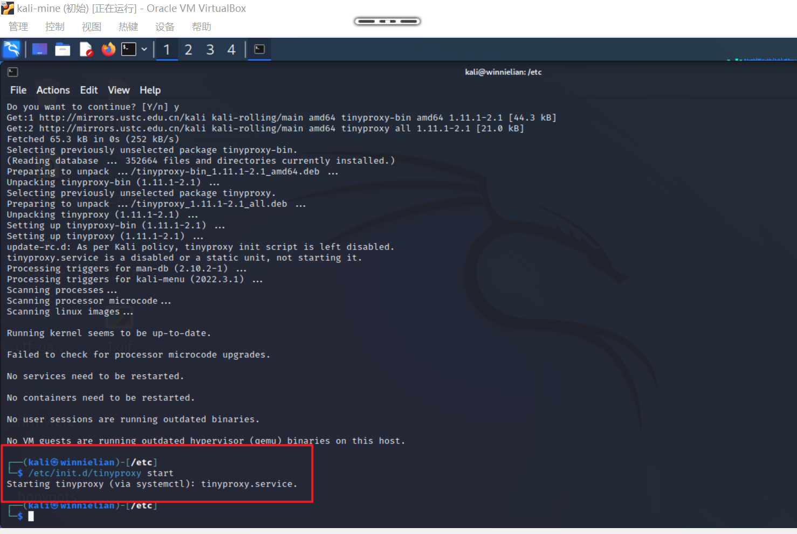
查找配置文件
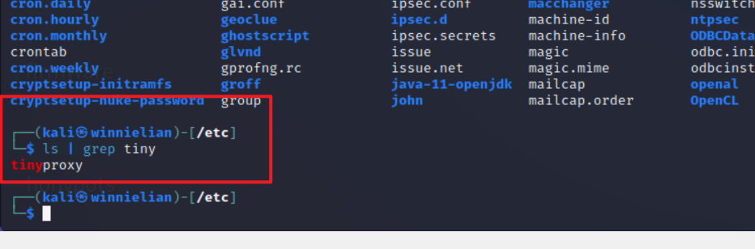
修改前，先备份一下
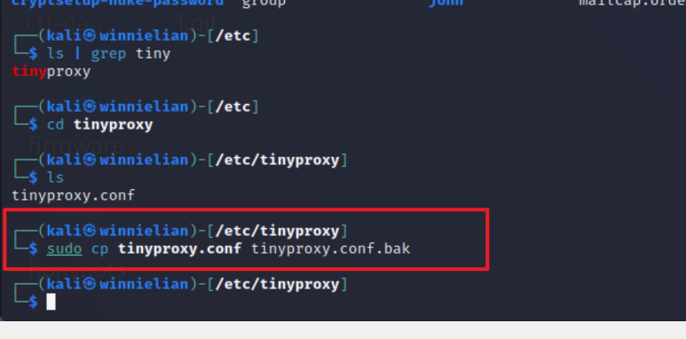
这里allow一下192.168.56.0
查看一下ip
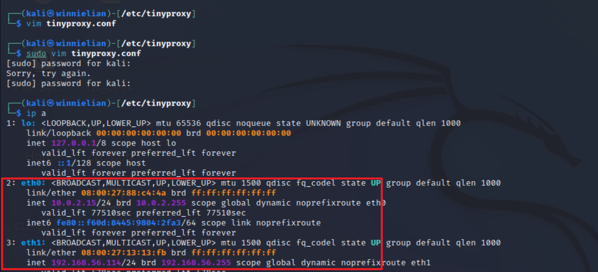

在宿主机中的Firefox上安装一个foxproxy方便管理代理
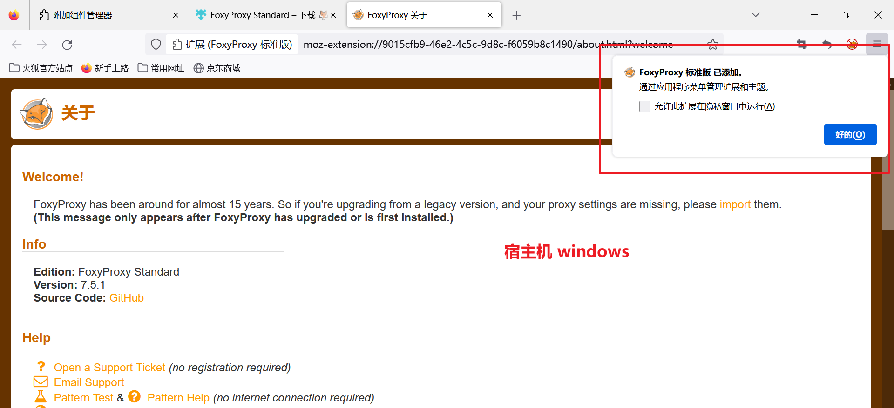
设置代理在8888端口
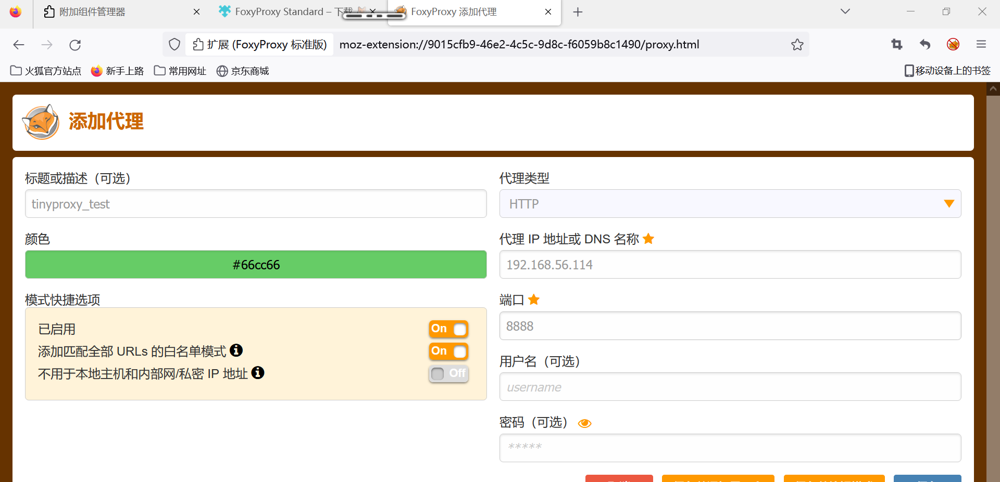

### 抓包并分析
在宿主机上访问https站点，同时在 kali 中启动wireshark，开启对网卡 eth1 的抓包
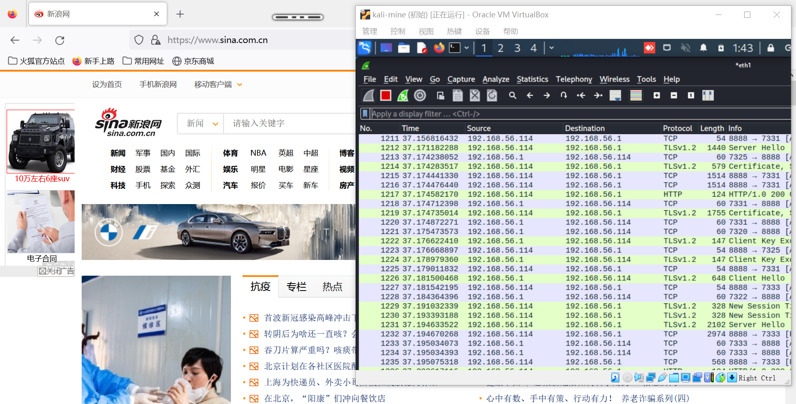
分析https流量包:`http.request.method eq CONNECT`查看所有代理请求，确实有的，且印证了代理服务器知道通信的站点，这里也可以看到，connect 请求发送时，会捎带站点信息（新浪、百度）
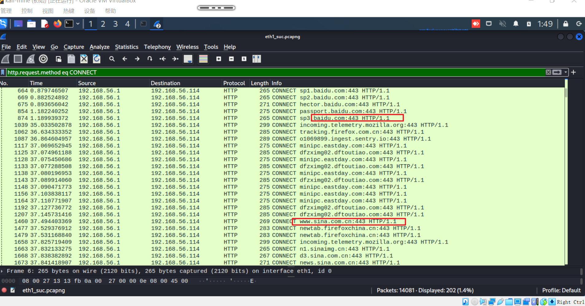
`http.request.method eq GET` 查看所有HTTP GET代理请求，实在是抓到一个、、、
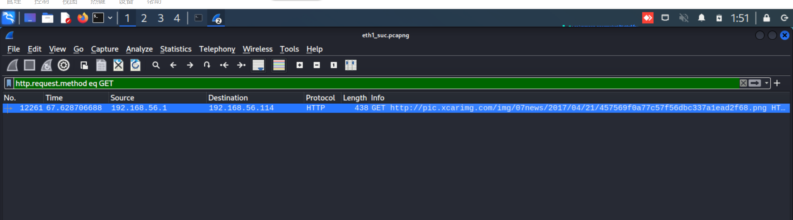
具体查看其中的包，可以看到具体内容是 encrypted ，所以代理服务器不知道具体的通信内容，由https提供加密
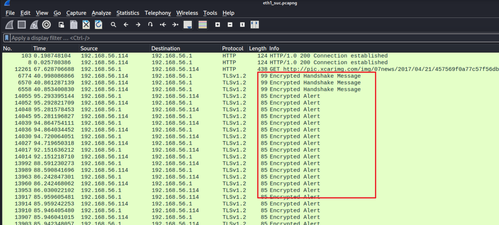

这里也直接对比了一下http和https，http几乎可以得到所有的信息，而https都是 cipher 
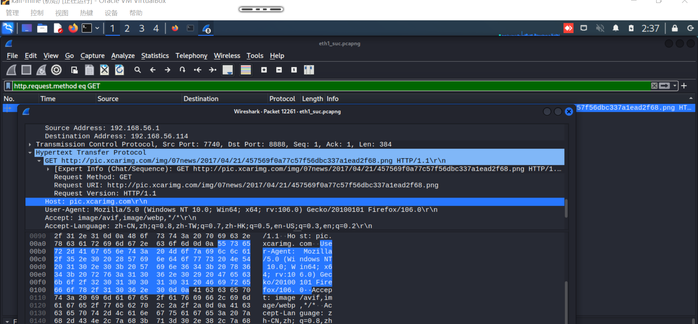
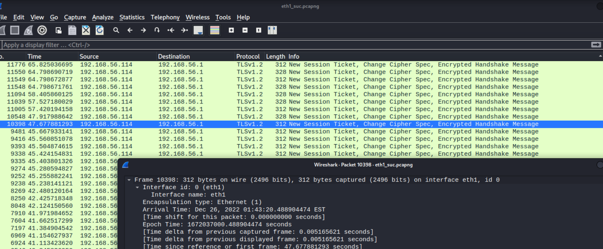

### 多验证一下代理服务器是否被察觉
后来又抓取了一遍，这次用浏览器的开发者工具看看是否有察觉到使用代理服务器，也就是`via`字段的添加
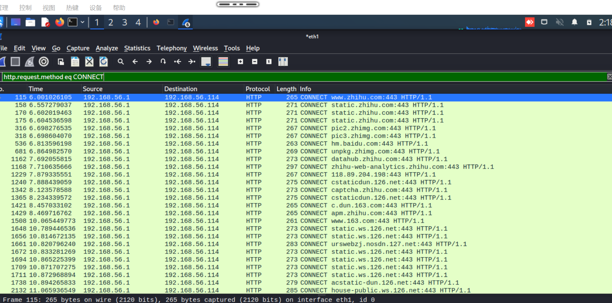
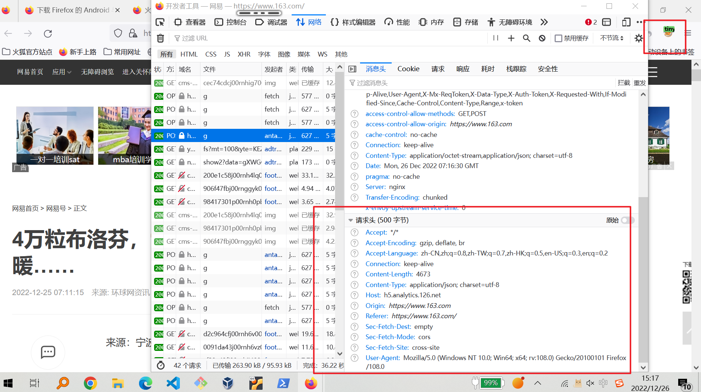
这里一开始是没有发现via字段的，本来坦然而放心的准备离去，结果查看了几个发现了端倪
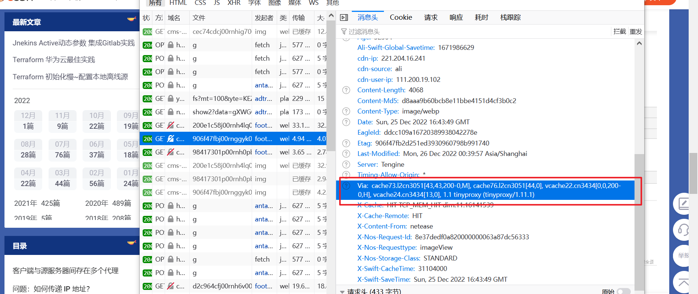
发现其中有一个是有via字段的，都查看后发现，在标注为『用来获取此资源的链接并不安全』的请求有via字段
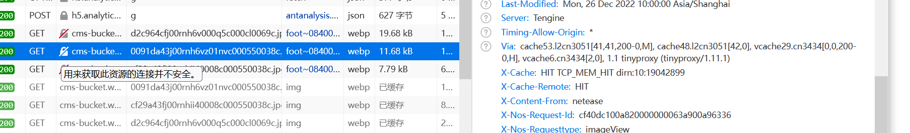
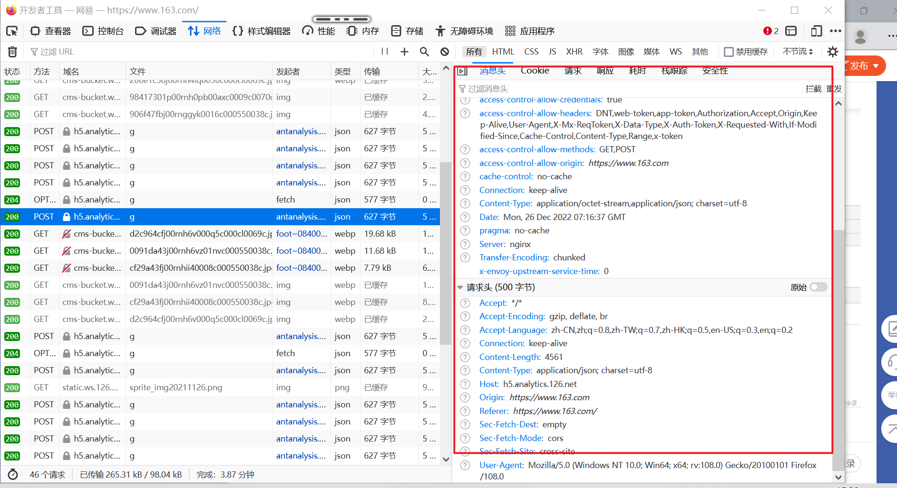
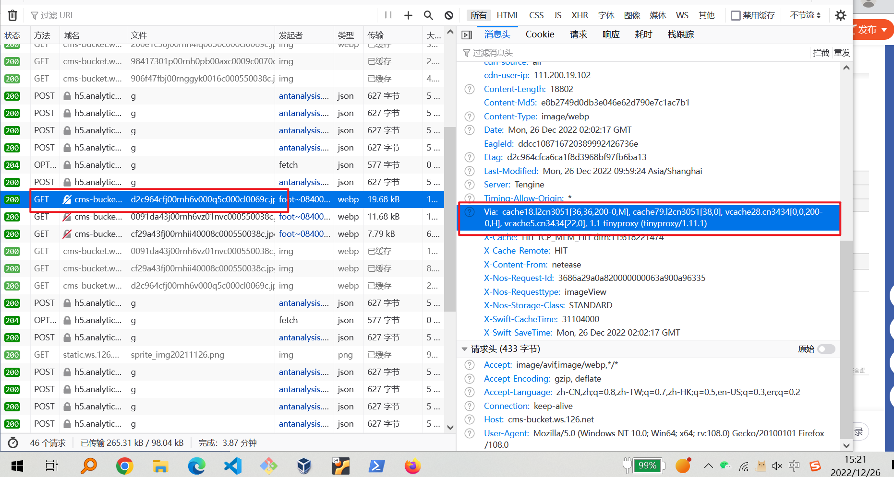
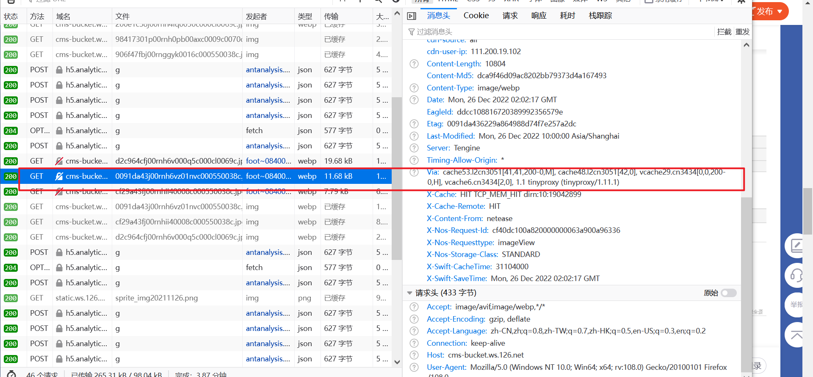
也显而易见，这里的『不安全』就是，该服务是http协议，而其他的都是https协议

### 反向实验测试确保
最后还测试了一下，不用代理，确认不能抓包（这里有的都是tcp传输层的通信，看起来像是在确认链接是否还存在，因为他比较笨嘛，所以到29m之后就没有通信了，大概是断开了吧？
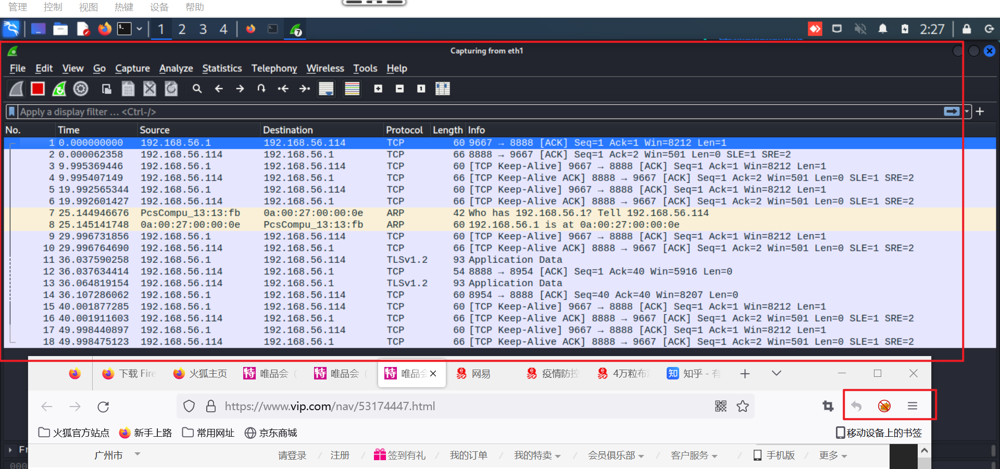

### 疑问
-  感觉 via 字段的问题不太全面，因为 foxproxy 本来也是Firefox 中的插件，所以不排除本来就和浏览器“私通”的可能性？又但是http和https的区别而非随机似乎又佐证了应该和 HSTS 有关，所以感觉应该是不太严谨吧？
-  其实实验还做了对于网卡 eth0 的，目前还有点没想清楚为什么 10.0.0.0 这块没成功
-  （其实有点不太理解“虚拟机网络设置为NAT和端口转发中的”端口转发），感觉和上一个问题有关


## refer
- [HTTP_Strict_Transport_Security_Cheat_Sheet](https://cheatsheetseries.owasp.org/cheatsheets/HTTP_Strict_Transport_Security_Cheat_Sheet.html)
- [第三章 网络安全应用基础](https://c4pr1c3.github.io/cuc-ns/chap0x03/main.html#312-http-%E4%BB%A3%E7%90%86)
- [HTTP代理服务器实验](https://c4pr1c3.github.io/cuc-ns/chap0x03/exp.html)
  > ps : 课本实验中好多链接都挂了诶、、