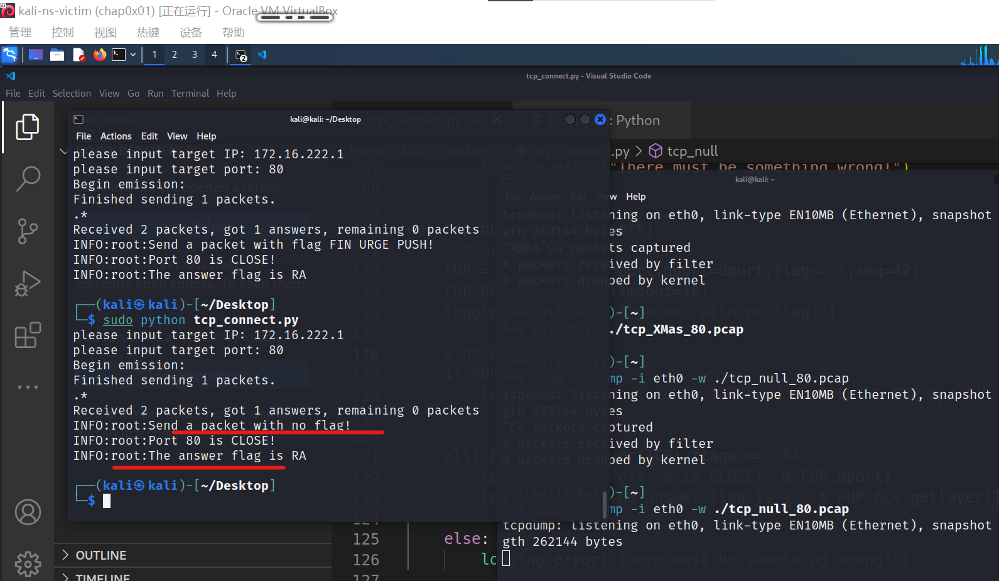
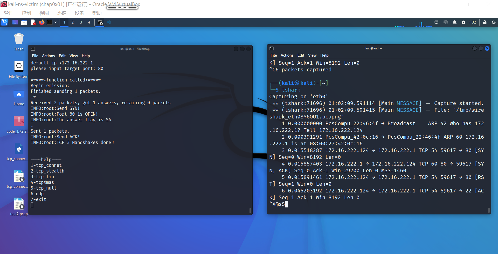

# 基于 Scapy 编写端口扫描器

## 实验目的
- 掌握网络扫描之端口状态探测的基本原理
  
## 实验环境
- python + scapy
- nginx 
- 扫描主机
  - kali 
    - ip:`172.16.222.124`
    - python:3.10.15
- 被扫描主机
  - debian
    - ip:`172.16.222.1`
  
## 实验要求

- 😢❌迟交
- 🙏✔ 一周内补交
---
- [x] 禁止探测互联网上的 IP ，严格遵守网络安全相关法律法规
- [x] 完成以下扫描技术的编程实现
    - [x] TCP connect scan / TCP stealth scan
    - [x] TCP Xmas scan / TCP fin scan / TCP null scan
    - [x] UDP scan
- [x] 上述每种扫描技术的实现测试均需要测试端口状态为：开放、关闭 和 过滤 状态时的程序执行结果
- [x] 提供每一次扫描测试的抓包结果并分析与课本中的扫描方法原理是否相符？如果不同，试分析原因；
- [x] 在实验报告中详细说明实验网络环境拓扑、被测试 IP 的端口状态是如何模拟的


## 实验过程
> 写在前面：因为每种扫描都要对被扫描主机修改防火墙的规则，为了方便 实验的过程是将各代码写好之后，一起实验的，但为了实验报告分类更有条理，还是分类描述的

[过程中不断整理之后的实验代码](./chap0x05_attachments/tcp_connect.py)
```python

import logging

logging.basicConfig(level=logging.INFO)


from scapy.all import *

def tcp_connect(ip,port,dport):

    # Create SYN packet
    SYN = ip/TCP(sport=port,dport=dport,flags="S",seq=42)
    SYN_ACK = sr1(SYN,timeout=5)
    logging.info("Send SYN!")

    # no response
    if SYN_ACK is None:
        logging.info("Port %d is filtered" % SYN.dport) 
    
    
    # Send SYN and receive SYN,ACK
    elif SYN_ACK.getlayer(TCP).flags == 'SA':
        logging.info("Port %d is OPEN!" % SYN.dport)
        logging.info("The answer flag is %s" % SYN_ACK.getlayer(TCP).flags)
        # Create ACK packet
        ACK = ip/TCP(sport=SYN_ACK.dport,dport=22,flags="A",seq=SYN_ACK.ack,ack=SYN_ACK.seq+1)
        # send the ack packet
        send(ACK)
        logging.info("Send ACK!")
        logging.info("TCP 3 Handshakes done！")


    elif SYN_ACK.getlayer(TCP).flags == 'RA' :
        logging.info("Port %d is CLOSE!" % SYN.dport)
        logging.info("The answer flag is %s" % SYN_ACK.getlayer(TCP).flags)

    else:
        logging.error("There must be something wrong!")
            

def tcp_stealth(ip,port,dport):
        # Create SYN packet
    SYN = ip/TCP(sport=port,dport=dport,flags="S",seq=42)
    SYN_ACK = sr1(SYN,timeout=5)
    logging.info("Send SYN!")

    # no response
    if SYN_ACK is None:
        logging.info("Port %d is filtered" % SYN.dport) 
    
    
    # Send SYN and receive SYN,ACK
    elif SYN_ACK.getlayer(TCP).flags == 'SA':
        logging.info("Port %d is OPEN!" % SYN.dport)
        logging.info("The answer flag is %s" % SYN_ACK.getlayer(TCP).flags)
        # Create ACK packet
        RST = ip/TCP(sport=SYN_ACK.dport,dport=22,flags="R",seq=SYN_ACK.ack,ack=SYN_ACK.seq+1)
        # send the ack packet
        send(RST)
        logging.info("Send RST!")


    elif SYN_ACK.getlayer(TCP).flags == 'RA' :
        logging.info("Port %d is CLOSE!" % SYN.dport)
        logging.info("The answer flag is %s" % SYN_ACK.getlayer(TCP).flags)

    else:
        logging.error("There must be something wrong!")


def tcp_fin(ip,port,dport):
    # Create SYN packet
    FIN = ip/TCP(sport=port,dport=dport,flags="F",seq=42)
    FIN_ACK = sr1(FIN,timeout=10)
    logging.info("Send FIN!")

    # no response
    if FIN_ACK is None:
        logging.info("Port %d is filtered or OPEN" % FIN.dport) 
    
    
    # Send SYN and receive SYN,ACK
    elif FIN_ACK.getlayer(TCP).flags == 'RA':
        logging.info("Port %d is CLOSE!" % FIN.dport)
        logging.info("The answer flag is %s" % FIN_ACK.getlayer(TCP).flags)

    else:
        logging.error("There must be something wrong!")


def tcp_Xmas(ip,port,dport):
     # Create packet
    FUP = ip/TCP(sport=port,dport=dport,flags="FUP",seq=42)
    FUP_ACK = sr1(FUP,timeout=10)
    logging.info("Send a packet with flag FIN URGE PUSH!")

    # no response
    if FUP_ACK is None:
        logging.info("Port %d is filtered or OPEN" % FUP.dport) 


    elif FUP_ACK.getlayer(TCP).flags == 'RA' :
        logging.info("Port %d is CLOSE!" % FUP.dport)
        logging.info("The answer flag is %s" % FUP_ACK.getlayer(TCP).flags)

    else:
        logging.error("There must be something wrong!")


def tcp_null(ip,port,dport):
      # Create packet
    FUP = ip/TCP(sport=port,dport=dport,flags="",seq=42)
    FUP_ACK = sr1(FUP,timeout=10)
    logging.info("Send a packet with no flag!")

    # no response
    if FUP_ACK is None:
        logging.info("Port %d is filtered or OPEN" % FUP.dport) 


    elif FUP_ACK.getlayer(TCP).flags == 'RA' :
        logging.info("Port %d is CLOSE!" % FUP.dport)
        logging.info("The answer flag is %s" % FUP_ACK.getlayer(TCP).flags)

    else:
        logging.error("There must be something wrong!")


def UDP_scan(ip,port,dport):
     # Create packet
    udp = ip/UDP(sport=port,dport=dport)
    udp_ACK = sr1(udp,timeout=10)
    logging.info("Send a packet with no flag!")

    # no response
    if udp_ACK is None:
        logging.info("Port %d is filtered or OPEN" % udp.dport) 


    elif udp_ACK.getlayer(ICMP):
        udp_ACK.summary()
        logging.info("Port %d is CLOSE!" % udp.dport)
        logging.info("The answer code is %s" % udp_ACK.getlayer(ICMP).code)

    else:
        logging.error("There must be something wrong!")

def pre():
    ip = input("please input target IP: ")
    if ip == "":
        print("default ip :172.16.222.1")
        ip = "172.16.222.1"
    # print(ip)
    ip = IP(dst=ip)
    port = RandNum(1024,65535)
    dport = int(input("please input target port: "))
    print("\n******function called******")
    return ip,port,dport


h = int(input("====help====\n1-tcp_connet\n2-tcp_stealth\n3-tcp_fin\n4-tcpXmas\n5-tcp_null\n6-udp\n7-exit\n"))
while(h != 7):
    ip,port,dport = pre()
    if h == 1:
        tcp_connect(ip,port,dport)
    if h==2:
        tcp_stealth(ip,port,dport)
    if h==3:
        tcp_fin(ip,port,dport)
    if h==4:
        tcp_Xmas(ip,port,dport)
    if h==5:
        tcp_null(ip,port,dport)
    if h==6:
        UDP_scan(ip,port,dport)
    if h==7:
        break
    h = int(input("\n\n====help====\n1-tcp_connet\n2-tcp_stealth\n3-tcp_fin\n4-tcpXmas\n5-tcp_null\n6-udp\n7-exit\n"))

```

### 准备工作
- kali has scapy
- 学习一下 tcpdump 用于抓包存储
  - 经历了一下错误
  - `sudo tcpdump -i {interface} -w {filename}`
  - `wireshark {filename}` 可以用图形化界面查看一下
- 温顾常用端口
  - 为了更多样性，选取 80 与 22 端口用于测试tcp扫描；53端口用于测试udp协议
  - 因为22端口用于ssh链æ¥ä¸€ç›´æä¾›æœåŠ¡è€Œ80端口前期没有任何服务提供，所以测试过程先对二者进行『tcp 端口开放、关闭』的扫描测试
  - 然后使用nginx在80端口提供服务后，利用 iptables 的规则过滤掉扫描主机的请求后，完成『过滤』的扫描测试

### TCP connect scan
#### 原理
使用最基本的 TCP 三次握手链接建立机制，建立一个链接到目标主机的特定端口上。

首先发送一个 SYN 数据包到目标主机的特定端口上，接着我们可以通过接收包的情况对端口的状态进行判断：如果接收到的是一个 SYN/ACK 数据包，则说明端口是开放状态的；如果接收到的是一个 RST/ACK 数据包，通常意味着端口是关闭的并且链接将会被重置；而如果目标主机没有任何响应则意味着目标主机的端口处于过滤状态。

与此同时，若接收到 SYN/ACK 数据包（即检测到端口是开启的），便发送一个 ACK 确认包到目标主机，这样便完成了三次握手连接机制。

#### 实验记录
代码如下
```python
import logging
logging.basicConfig(level=logging.INFO)

from scapy.all import *

def tcp_connect(ip,port,dport):
    # Create SYN packet
    SYN = ip/TCP(sport=port,dport=dport,flags="S",seq=42)
    SYN_ACK = sr1(SYN)
    logging.info("Send SYN!")

    # no response
    if SYN_ACK is None:
        logging.info("Port %d is filtered" % SYN.dport) 

    # Send SYN and receive SYN,ACK
    elif SYN_ACK.getlayer(TCP).flags == 'SA':
        logging.info("Port %d is OPEN!" % SYN.dport)
        logging.info("The answer flag is %s" % SYN_ACK.getlayer(TCP).flags)

        # Create ACK packet
        ACK = ip/TCP(sport=SYN_ACK.dport,dport=22,flags="A",seq=SYN_ACK.ack,ack=SYN_ACK.seq+1)

        # send the ack packet
        send(ACK)
        logging.info("Send ACK!")

        logging.info("TCP 3 Handshakes done！")

    elif SYN_ACK.getlayer(TCP).flags == 'RA' :
        logging.info("Port %d is CLOSE!" % SYN.dport)
        logging.info("The answer flag is %s" % SYN_ACK.getlayer(TCP).flags)

    else:
        logging.error("There must be something wrong!")


ip = input("please input target IP: ")
# print(ip)
ip = IP(dst=ip)
port = RandNum(1024,65535)
dport = int(input("please input target port: "))
tcp_connect(ip,port,dport)
```

- open 
  - 收到 SYN/ACK 回复后，再次发送packet，完成『三次握手』
  -  
  - 
- close
  - 收到 RA 包
  - 
  - 
- filtered
  - 超时无响应
  - 
  - 

### TCP Stealth scan
#### 原理
其实就是 TCP SYN 扫描，相比 connect 只是缺少了第三次握手言和而已，只发送 SYN 而并不需要打开一个完整的链接，发送一个 SYN 包启动三方握手链接机制，并等待响应。如果我们接收到一个 SYN/ACK 包表示目标端口是开放的；如果接收到一个 RST/ACK 包表明目标端口是关闭的，当得到的是一个 SYN/ACK 包时通过发送一个 RST 包立即拆除连接；如果端口是被过滤的状态则没有响应。

#### 实验过程
函数代码如下
```python
def tcp_stealth(ip,port,dport):
        # Create SYN packet
    SYN = ip/TCP(sport=port,dport=dport,flags="S",seq=42)
    SYN_ACK = sr1(SYN,timeout=5)
    logging.info("Send SYN!")

    # no response
    if SYN_ACK is None:
        logging.info("Port %d is filtered" % SYN.dport) 
    
    
    # Send SYN and receive SYN,ACK
    elif SYN_ACK.getlayer(TCP).flags == 'SA':
        logging.info("Port %d is OPEN!" % SYN.dport)
        logging.info("The answer flag is %s" % SYN_ACK.getlayer(TCP).flags)
        # Create ACK packet
        RST = ip/TCP(sport=SYN_ACK.dport,dport=22,flags="R",seq=SYN_ACK.ack,ack=SYN_ACK.seq+1)
        # send the ack packet
        send(RST)
        logging.info("Send RST!")


    elif SYN_ACK.getlayer(TCP).flags == 'RA' :
        logging.info("Port %d is CLOSE!" % SYN.dport)
        logging.info("The answer flag is %s" % SYN_ACK.getlayer(TCP).flags)

    else:
        logging.error("There must be something wrong!")
```

- open 
  - 收到 SYN/ACK 回复后，再次发送packet，没有完成『三次握手』但启动了握手机制，得到了回应 S/A
  -  
  - 
- close
  - 收到 RA 包，接着发出带有 RST 标志的包拆除连接
  - 
  - 
- filtered
  - 超时无响应
  - 
  - 

### TCP FIN scan
#### 原理
仅发送 FIN 包，它可以直接通过防火墙，如果端口是关闭的就会回复一个 ==RST== 包，如果端口是开放或过滤状态则对 FIN 包没有任何响应。
> 这里经过实验发现好像返回的应该是RST/ACK的包，而并非单纯的RST包

#### 实验过程
```python
def tcp_fin(ip,port,dport):
    # Create SYN packet
    FIN = ip/TCP(sport=port,dport=dport,flags="F",seq=42)
    FIN_ACK = sr1(FIN,timeout=10)
    logging.info("Send FIN!")

    # no response
    if FIN_ACK is None:
        logging.info("Port %d is filtered or OPEN" % FIN.dport) 
    
    
    # Send SYN and receive SYN,ACK
    elif FIN_ACK.getlayer(TCP).flags == 'RA':
        logging.info("Port %d is CLOSE!" % FIN.dport)
        logging.info("The answer flag is %s" % FIN_ACK.getlayer(TCP).flags)

    else:
        logging.error("There must be something wrong!")

```

- open 
  - 超时没有回应，仅能认为没有关闭（其实无法区分开放或者过滤
  -  
  - 
- close
  - 收到 RA 包，**这里经过实验发现好像返回的应该是RST/ACK的包，而并非单纯的RST包**
  - 
  - 
- filtered
  - 超时没有回应，仅能认为没有关闭（其实无法区分开放或者过滤
  - 
  - 

### TCP Xmas scan
#### 原理
Xmas 发送一个 TCP 包，并对 TCP 报文头 FIN、URG 和 PUSH 标记进行设置。若是关闭的端口则响应 RST 报文；开放或过滤状态下的端口则无任何响应。

#### 实验过程
```python
def tcp_Xmas(ip,port,dport):
     # Create packet
    FUP = ip/TCP(sport=port,dport=dport,flags="FUP",seq=42)
    FUP_ACK = sr1(FUP,timeout=10)
    logging.info("Send a packet with flag FIN URGE PUSH!")

    # no response
    if FUP_ACK is None:
        logging.info("Port %d is filtered or OPEN" % FUP.dport) 


    elif FUP_ACK.getlayer(TCP).flags == 'RA' :
        logging.info("Port %d is CLOSE!" % FUP.dport)
        logging.info("The answer flag is %s" % FUP_ACK.getlayer(TCP).flags)

    else:
        logging.error("There must be something wrong!")

```

- open 
  - 超时没有回应，仅能认为没有关闭（其实无法区分开放或者过滤
  -  
  - 
- close
  - 收到 RA 包，**这里经过实验发现好像返回的应该是RST/ACK的包，而并非单纯的RST包**
  - 
  - 
- filtered
  - 超时没有回应，仅能认为没有关闭（其实无法区分开放或者过滤
  - 
  - 


### TCP null scan

#### 原理
发送一个 TCP 数据包，关闭所有 TCP 报文头标记。只有关闭的端口会发送 RST 响应。

#### 实验过程

函数如下
```python
def tcp_null(ip,port,dport):
      # Create packet
    FUP = ip/TCP(sport=port,dport=dport,flags="",seq=42)
    FUP_ACK = sr1(FUP,timeout=10)
    logging.info("Send a packet with no flag!")

    # no response
    if FUP_ACK is None:
        logging.info("Port %d is filtered or OPEN" % FUP.dport) 


    elif FUP_ACK.getlayer(TCP).flags == 'RA' :
        logging.info("Port %d is CLOSE!" % FUP.dport)
        logging.info("The answer flag is %s" % FUP_ACK.getlayer(TCP).flags)

    else:
        logging.error("There must be something wrong!")
```
- open 
  - 超时没有回应，仅能认为没有关闭（其实无法区分开放或者过滤
  -  
  - 
- close
  - 收到 RA 包，**这里经过实验发现好像返回的应该是RST/ACK的包，而并非单纯的RST包**
  - 
  - 
- filtered
  - 超时没有回应，仅能认为没有关闭（其实无法区分开放或者过滤
  - 
  - 


### UPD scan
#### 原理
UDP 是一个无链接的协议，当我们向目标主机的 UDP 端口发送数据,我们并不能收到一个开放端口的确认信息,或是关闭端口的错误信息。可是，在大多数情况下，当向一个未开放的 UDP 端口发送数据时,其主机就会返回一个 ICMP 不可到达(ICMP_PORT_UNREACHABLE)的错误，因此大多数 UDP 端口扫描的方法就是向各个被扫描的 UDP 端口发送零字节的 UDP 数据包，如果收到一个 ICMP 不可到达的回应，那么则认为这个端口是关闭的,对于没有回应的端口则认为是开放的，但是如果目标主机安装有防火墙或其它可以过滤数据包的软硬件,那我们发出 UDP 数据包后,将可能得不到任何回应,我们将会见到所有的被扫描端口都是开放的。

学习一下 ICMP 的『不可达到』的回应是`code`字段为`3`

#### 实验过程
函数代码如下
```python
def UDP_scan(ip,port,dport):
     # Create packet
    udp = ip/UDP(sport=port,dport=dport)
    udp_ACK = sr1(udp,timeout=10)
    logging.info("Send a packet with no flag!")

    # no response
    if udp_ACK is None:
        logging.info("Port %d is filtered or OPEN" % udp.dport) 


    elif udp_ACK.getlayer(ICMP):
        udp_ACK.summary()
        logging.info("Port %d is CLOSE!" % udp.dport)
        logging.info("The answer code is %s" % udp_ACK.getlayer(ICMP).code)

    else:
        logging.error("There must be something wrong!")
```

- open 
  - 不可靠的udp本身就不会回应，所以这里同样也是无回应（本质上无法区分开放或者过滤
  -  
  - 
- close
  - 收到已更 ICMP 的 UNreachable 的回应
  - 
  - 
- filtered
  - 无回应（本质上无法区分开放或者过滤
  - 
  - 

## 问题与解决

### R 与 RA
根据课本所描述，在 tcp 的 fin 等扫描时，『如果端口是关闭的就会回复一个 RST 包』，但后来实验过程中发现，这里应该是强调会返回 ã€RST』的标志，其实应该是返回 RST/ACK 的包
回忆上学期的计网也确实是，tcp的『可靠性』让每一次到达之后都面向字节流的有确认机制，所以既然到了，ack怎么能不在呢对吧

### ufw 与 iptables
在设置过滤的时候，先使用了ufw工具想着简单的直接过滤一下
`sudo ufw deny 80`

然后下载并启动了nginx

多重考察 nginx 确实已启动，已在80端口提供服务
```bash
sudo systemctl status nginx.service
ps -ef | grep nginx
```


多重考察 ufw 一定启动
```bash
sudo systemctl start ufw
sudo systemctl status ufw
sudo ufw status
```


但是 80 端口测试就是一直 open 状态，没有收到验证性实验『已知』的『过滤』状态应该有的结果


猜测可能是新的规则需要重启一下服务才能启用
```bash
sudo ufw reload 
# 没有用
```


再次猜测，怀疑是iptables的锅
修改iptables
直接添加规则, iptables_not_working


利用快照返回状态后
```bash
# 查看当前的规则
sudo iptables -L --line-number
# 思考后决定先去掉原规则
sudo iptables -D FORWARD 4
# 然后再追加tcp
sudo iptables -A INPUT -P tcp --dport 80 -j DROP
# 追加udp时，尝试匹配地址
sudo iptables -A INPUT -P udp --dport 53 -s 172.16.222.124 -j DROP
```


成功后再次复盘
```bash
# 删掉新的两条规则
sudo iptables -D INPUT 1
sudo iptables -D INPUT 1
# 再次确认
sudo iptables -L

# 重新安装ufw，过滤80端口并确认
sudo apt install ufw
sudo ufw deny 80
sudo ufw enable
sudo ufw status
```


然后再次测试 tcp connection 扫描

成功！！！

最后经过试验后再次复盘，ufw没有成功的原因确实是因为iptables冲突，因为iptables更底层，首先响应了该规则


## refer
- [scapy.readthedocs](https://scapy.readthedocs.io/en/latest/usage.html)
- [Creating ACK-GET packets with scapy](https://www.thice.nl/creating-ack-get-packets-with-scapy/)
- [How to list all iptables rules with line numbers on Linux](https://www.cyberciti.biz/faq/how-to-list-all-iptables-rules-in-linux/)
- [How To Set Up a Firewall with UFW on Debian 10](https://www.digitalocean.com/community/tutorials/how-to-set-up-a-firewall-with-ufw-on-debian-10)
- [TCP/UDP端口列表](https://zh.wikipedia.org/wiki/TCP/UDP%E7%AB%AF%E5%8F%A3%E5%88%97%E8%A1%A8)
- [How do you add comments on UFW firewall rule?](https://www.cyberciti.biz/faq/category/iptables/)
- [Iptables Tutorial – Securing Ubuntu VPS with Linux Firewall](https://www.hostinger.com/tutorials/iptables-tutorial)
- [cheat-tcpdump](https://cheat.sh/tcpdump)
- [第五章 网络扫描](https://c4pr1c3.github.io/cuc-ns/chap0x05/main.html)
  