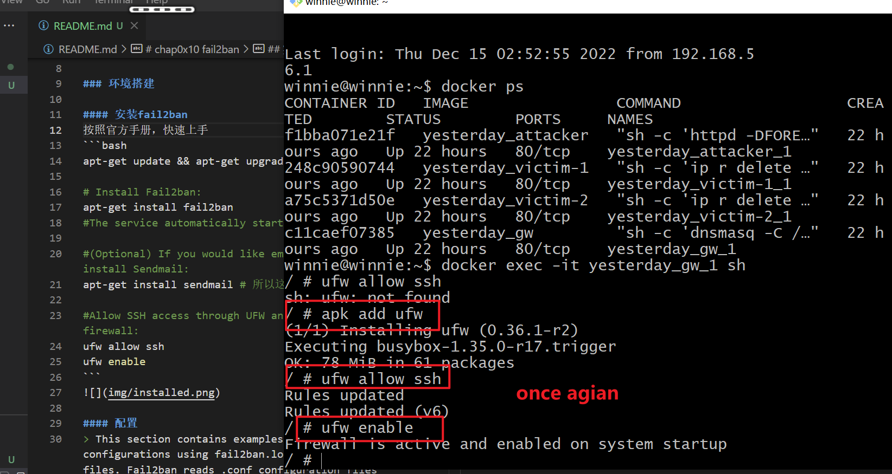

# chap0x10 fail2ban

## 实验环境
- ubuntu 20.04
- fail2ban 0.11.1

## 实验过程

### 环境搭建

#### 安装fail2ban
按照官方手册，快速上手
```bash
apt-get update && apt-get upgrade -y

# Install Fail2ban:
apt-get install fail2ban
#The service automatically starts.

#(Optional) If you would like email support, install Sendmail:
apt-get install sendmail # 所以这个就没安装了

#Allow SSH access through UFW and then enable the firewall:
ufw allow ssh
ufw enable
```


#### 配置
> This section contains examples of common Fail2ban configurations using fail2ban.local and jail.local files. Fail2ban reads .conf configuration files first, then .local files override any settings. Because of this, all changes to the configuration are generally done in .local files, leaving the .conf files untouched.

手册上介绍了，其实内置了一个备份修改配置的机制，『.conf』可视为基础配置，如有修改，可以在『.local』文件中，完成自定义的部分。这样也就相当于自带了一个备份，但是，又比较奇怪的，他没有自动给你这个『.local』文件，需要你自己手动备份一遍，，所以就，，，『有，但没完全有』
```sh
cp /etc/fail2ban/jail.conf /etc/fail2ban/jail.local

cp /etc/fail2ban/fail2ban.conf /etc/fail2ban/fail2ban.local

ls /etc/fail2ban/
action.d       fail2ban.local  jail.d           paths-common.conf
fail2ban.conf  filter.d        jail.local       paths-debian.conf
fail2ban.d     jail.conf       paths-arch.conf  paths-opensuse.conf

```


##### fail2ban.conf: 有关fail2ban的基础配置
- fail2ban.conf
    - loglevel: The level of detail that Fail2ban’s logs provide can be set to 1 (error), 2 (warn), 3 (info), or 4 (debug).
    - logtarget: Logs actions into a specific file. The default value of /var/log/fail2ban.log puts all logging into the defined file. Alternately, you can change the value to:
    - STDOUT: output any data
    - STDERR: output any errors
    - SYSLOG: message-based logging
    - FILE: output to a file
    - socket: The location of the socket file.
    - pidfile: The location of the PID file.

##### jail.conf:有关安全规则的配置
简单的基础配置
```bash
    [DEFAULT]

    ignoreip = 127.0.0.1/8
    bantime = 600
    findtime = 600
    maxretry = 3
    backend = auto
    usedns = warn
    destemail = root@localhost
    sendername = Fail2Ban
    banaction = iptables-multiport
    mta = sendmail
    protocol = tcp

    # The chain setting refers to the series of iptables rules\
    # where jumps should be added in ban-actions. \
    # By default, this is set to the INPUT chain. \
    chain = INPUT 
    action_ = %(banaction)...
    action_mw = %(banaction)...
    protocol="%(protocol)s"...
    action_mwl = %(banaction)s...
```

----
过了一会的分割线
在容器内重构的分割线

浅浅安装一个vim用作文本编辑

重新备份一下配置文件


move on
修改配置文件，试验一下（1_jail.local)，发现iptables并没有找到对应的链，认为可能是需要重启一下fail2ban的服务，于是使用`systemctl`发现找不到相关命令。官网查找发现，人家内置的服务管理是`openRC`，于是，按照文档来一遍


发现真是见鬼，不是『init』 吗、、、 

学习了一下之后
```bash
# 安装openrc
apk add openrc
rc-service --list | grep fail # 找到这里有fail2ban了
fail2ban

# 继续学习一下具体rc的管理
 rc-status -a
 * Caching service dependencies ...
Service `fail2ban' needs non existent service `logger' 
# 认为这里的意思是缺少相关依赖 

Service `hwdrivers' needs non existent service `dev'
Service `machine-id' needs non existent service `dev'                                                    [ ok ]
Runlevel: sysinit
Runlevel: default
Runlevel: nonetwork
Runlevel: shutdown
Runlevel: boot
Dynamic Runlevel: hotplugged
Dynamic Runlevel: needed/wanted
Dynamic Runlevel: manual

```
查看当前的所有服务状态，然后认为是 fail2ban 需要 logger，但缺少依赖，于是打算安装logger，但好像是已经安装过了，于是再次确定是否有fail2ban在运行，发现确实是没有


查看了一下当前安装的版本，和有关版本，尝试是不是应该换个版本安装
再此之前，还是再次google了一下apline&fail2ban，然后看了看，见了个鬼


fine,先重新安装一个试试吧

不行了，太混乱了、、搁置吧、、、


---
又是隔了一会儿的分割线
那就继续吧

但还是不行，之后再次查看官方网站，确实有最新版，但是就在考虑，不会是这个问题吧
查看当前镜像源

于是修改镜像源到一个国内且为/edge分支上的
再安装一次，就也可以看到，真的有1.的版本了

一下操作就集成在一起看看吧
```bash
#安装
apk add <pak_name>
# 指定安装版本
apk add fail2ban=1.0.2-r1 

# 可以更改镜像源
cat /etc/apk/repos 

# 删除
apk del <pak_name> 

apk search <pak_name>

# 查看一下目前的fail2ban的情况
apk info -a | grep fail 

docker ps -a # 虚拟机内，非docker，查看当前的容器
docker start cyberrangeslim_gw_1
docker exec -it <container_name> sh

# 进入容器后
rc-update add fail2ban
rc status # 查看状况，根本不行
```


### refer
- [openRC](https://www.cnblogs.com/jackadam/p/9290366.html)
- [Fail2ban](https://wiki.alpinelinux.org/wiki/Fail2ban)
- [Fail2ban-wiki](https://www.fail2ban.org/wiki/index.php/Main_Page)
- [apk](https://wangchujiang.com/linux-command/c/apk.html)